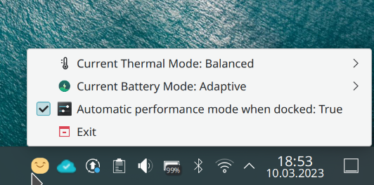

# dell-power-tray
Power management for Dell laptops


# Requirements
* libsmbios binary utilities (https://github.com/dell/libsmbios). This one is probably available in your package manager.
```
# On Fedora
sudo dnf install smbios-utils-bin
```
```
# On Ubuntu
sudo apt update && sudo apt install smbios-utils
```
* Python package manager: pip
```
# On Fedora
sudo dnf install python3-pip 
```
```
# On Ubuntu
sudo apt update && sudo apt install python3-pip
```
* PyQt5 (Installed via pip. See instructions below)
# Installation
* Navigate to where you want your project to reside:
```
# Where ever you want really, this is just an example
cd ~/.local/share/
```
* Clone project:
```
git clone https://github.com/DimseBoms/dell-power-tray
```
* navigate to newly downloaded project:
```
cd dell-power-tray
```
* Install python requirements:
```
pip install -r requirements.txt
```
* Run the application:
```
python3 main.py
```
* If you want it to show up in the app launcher:
```
python3 main.py --install
```
* To be able to run the necessary backend commands without having to run the app from the terminal for the sudo password you need to add this to the bottom of /etc/sudoers using visudo:
```
sudo visudo
```
```
# Dell Power Tray
your_username_here ALL = NOPASSWD: /usr/sbin/smbios-battery-ctl
your_username_here ALL = NOPASSWD: /usr/sbin/smbios-sys-info
your_username_here ALL = NOPASSWD: /usr/sbin/smbios-thermal-ctl
```

# Run custom scripts when docked/undocked
To run custom scripts when the machine is docked/undocked you can simply add the code you want to run in `/custom_scripts/on_dock.sh` or `/custom_scripts/off_dock.sh` depending on if you want it to run when the dock is connected or disconnected. You can find examples that you can modify in the custom script folder. To enable the function you have to tick off the option "Run custom scripts when docked" in the options menu.
